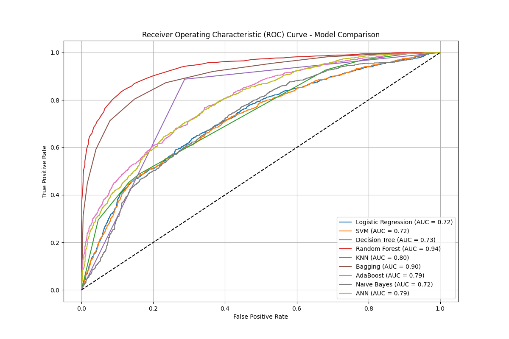

# loanrepay-prediction-ML-
"A machine learning project to predict loan defaults using Random Forest and SMOTE."
# Loan Repayment Prediction - Machine Learning Project

## 📌 Project Overview
This project applies **Machine Learning** and **Deep Learning** techniques to predict whether a borrower will pay back their loan fully. The dataset was highly imbalanced, so **SMOTE (Synthetic Minority Over-sampling Technique)** was used to balance the classes before training.

## 🛠️ Tech Stack
* **Language:** Python
* **Libraries:** Pandas, NumPy, Matplotlib, Seaborn, Scikit-Learn, TensorFlow/Keras
* **Techniques:** SMOTE (for balancing data), Label Encoding, Feature Scaling

## 📊 Models Trained & Compared
We trained 9 different models to find the best predictor:
1.  **Logistic Regression**
2.  **Support Vector Machine (SVM)**
3.  **Decision Tree**
4.  **Random Forest Classifier** (Top Performer)
5.  **K-Nearest Neighbors (KNN)**
6.  **Bagging Classifier**
7.  **AdaBoost Classifier**
8.  **Gaussian Naive Bayes**
9.  **Artificial Neural Network (ANN)**

## 📈 Key Results
* **Data Imbalance:** Addressed using SMOTE, increasing the minority class (Defaults) to match the majority class.
* **Best Model:** The **Random Forest Classifier** achieved the highest AUC score, indicating it is the most reliable model for this dataset.
* **Comparison:** Below is the ROC Curve comparing all models:

## 📂 Project Structure
* `loanrepay_prediction.ipynb`: The complete Google Colab notebook with all code and analysis.
* `modified_data.csv`: The cleaned dataset used for training.
* `heatmap.png`: Correlation matrix of features.
* `final_roc_comparison.png`: Performance comparison of all models.

## 🚀 How to Run
1. Open the `.ipynb` file in Google Colab.
2. Upload the `modified_data.csv` file.
3. Run all cells to see the training process and results.
